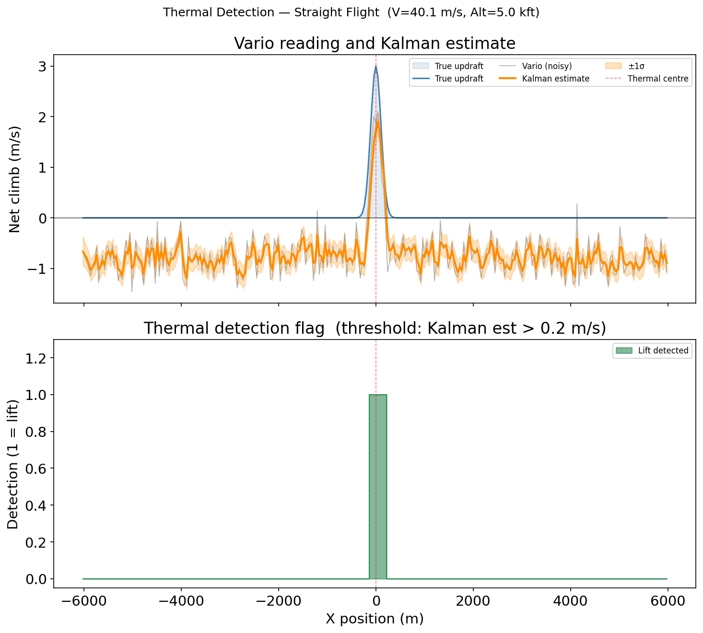

# Autonomous Thermal Soaring Simulation

This repository contains simple 1D and 2D simulations for autonomous thermal detection and steering in gliding flight. The project models a lightweight aircraft flying through a Gaussian thermal, using noisy variometer measurements and a Kalman filter to estimate lift.

## Project Overview

The goal of this project is to test how a glider or small UAV could detect and respond to rising air using simple onboard sensing and lightweight algorithms.

The simulations include:

- 1D straight-line thermal detection
- 2D flight path comparison with and without steering
- Gaussian thermal updraft modeling
- Noisy variometer measurements
- Kalman-filter-based lift estimation
- Threshold-based lift detection
- Basic steering response toward detected lift

## Files

| File | Description |
|---|---|
| `src/thermal_detection_1d.py` | Simulates a straight-line pass through a thermal and estimates lift using a Kalman filter |
| `src/thermal_comparison_2d.py` | Compares 2D flight behavior with straight flight and steering logic |
| `figures/` | Contains result plots from the simulations |

## Assumptions

- The aircraft flies at constant airspeed.
- The thermal is modeled as a Gaussian updraft.
- The aircraft has a constant sink rate in still air.
- Variometer measurements include zero-mean Gaussian noise.
- A scalar Kalman filter is used to smooth the noisy climb-rate signal.
- Lift is detected when the filtered estimate exceeds a set threshold.
- The 2D steering simulation uses simplified turning logic instead of a full flight dynamics model.

## Thermal Model

The updraft is modeled as:

$$
w(x,y) = W_0 e^{-((x-x_c)^2 + (y-y_c)^2)/R^2}
$$

## Results

### Simple Thermal Detection

### 2D Altitude Comparison

### 2D Flight Paths

